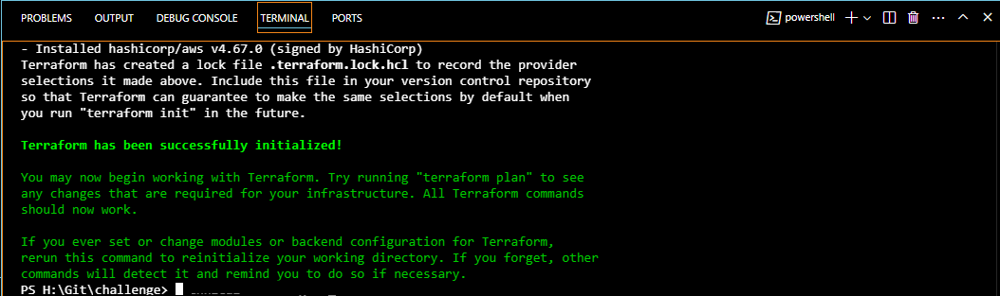
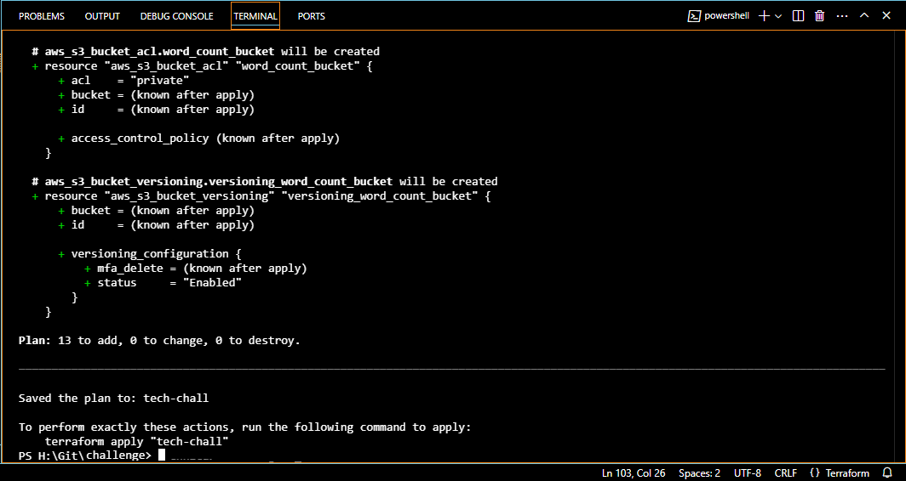
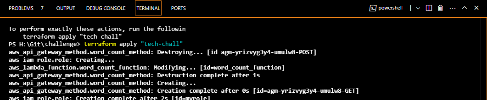
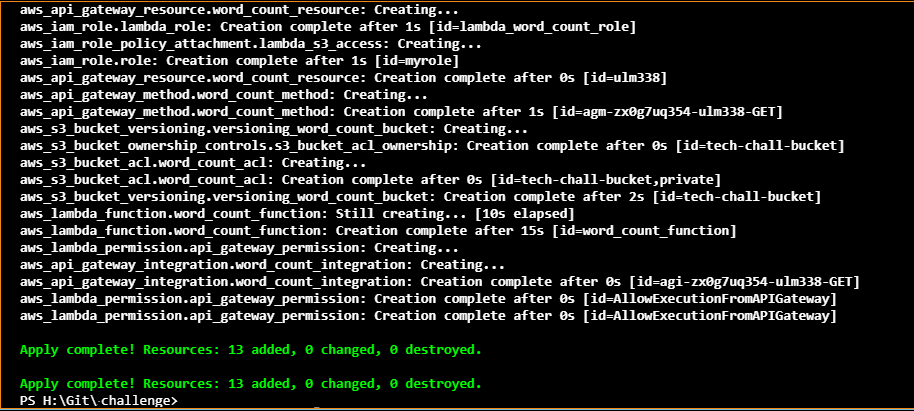

#  My AWS Lambda Challenge
Purpose : to develop a serverless application and its supporting infrastructure using Terraform on AWS. The app should accept POST requests containing a text parameter, analyze the text to identify the ten most frequent words, store this data in a JSON file, and respond with a URL where the user can download the generated file.

## Assumptions
1. Terraform installed
2. AWS CLI installed

## Deployment

### Configure AWS using the AWS account Access Key ID, Secret Access Key and region

        aws configure

> There are two scripts that have been prepared, namely: 
>> 1.	index.py  
Is the core of serverless function.
>> 2.	main.tf provides  
The Terraform configuration.

### Explanation
#### Lambda Function (index.py):
1. Takes text from POST request body.
2. It then splits the text into words, and counts their frequency, and gets the top 10 most frequent.
3. It then saves the top 10 words to a JSON file in the specified S3 bucket (AWS).
4. Once the above is done, it generates a pre-signed URL for the JSON file.
5. Returning the the URL in the response.

#### The Terraform configuration (main.tf):
1. This sets up the AWS as the provider and specifies the region etc.
2. Creates an S3 bucket to store the JSON files.
3. It then creates an IAM role for the Lambda function with permissions to access the S3 bucket.
4. It then defines the Lambda function, including its code, runtime, and environment variables.
5. Then set up API Gateway with a POST endpoint to trigger the Lambda function.
6. The API Gateway configuration for integration with Lambda is then performed.
7. Following the above, it deploys the API and grants necessary permissions.

### Deployment steps
The complete set of steps to be followed are as below:

1.Create a lambda_function.zip file containing index.py code.

        zip lambda_function.zip index.py

2.Run terraform init to initialize the Terraform work directory.

        terraform init

3.Run terraform plan

        terraform plan -out tech-chall

4.Run terraform apply to create the infrastructure.

        terraform apply "tech-chall"

5. Create Function URL in AWS

6.Test the API endpoint by sending a POST request with text data in the body

        curl -X POST -H "Content-Type: application/json" -d "{\"text\": \"Create a serverless app and its infrastructure with Terraform in AWS or GCP that will receive a POST call with a parameter containing a text. It should save in a json file the top 10 most frequent words and return to the user the URL to download the file.\"}" https://qagq2ijpeev6i434rw3jvreyl40dgoes.lambda-url.eu-north-1.on.aws/

>>output:

7. Clean up  
To avoid unnecessary charges, destroy the infrastructure when you're done

        terraform destroy

> Please find the AWS output screenshots ([here](output)) 

## Improvements for production grade launch
The difference between a prototype app and a production-ready are areas such as scalability, error handling, security, cost optimization, monitoring, deployment strategy, and testing. A few candidate points to consider addressing the same are as follows:

### Scalability
- We can enable Lambda auto scaling.
- We can look at optimizing S3 performance for example through Transfer Acceleration.

### Error handling & logging
- Detailed logging with the logging module can be implemented.
- Utilizing monitoring tools

### Security
- We can implement API Gateway authorization , e.g., API keys, IAM, custom authorizers.
- Restrictive S3 bucket policies can be configured.
- Considering retention policy for S3 bucket
- It is suggested that the principle of least privilege for Lambda permissions be put in place as a good practice.

### Cost optimization
- One should carefully optimize Lambda memory and timeout settings for cost efficiency.
- We can use S3 lifecycle policies to move to cheaper storage classes.
- The costs can be monitored in AWS using the ‘Cost Explorer’. We can even put in place some budget alerts.

### Monitoring and observability
- We can use CloudWatch to monitor the metrics for Lambda and S3 bucket.
- CloudWatch dashboards and alarms can be set up.

### Deployment strategy
- We can propose using blue/green deployment or canary releases.
- The infrastructure can be managed with Terraform features and capabilities.

### Testing
- We should write unit tests for the Lambda function.
- We must perform integration tests in timely fashion and appropriate periods.
- Load testing must be conducted
